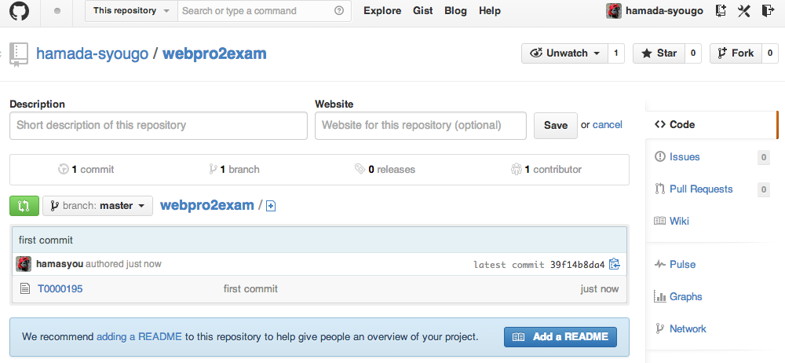
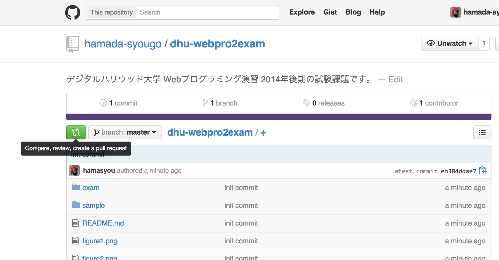
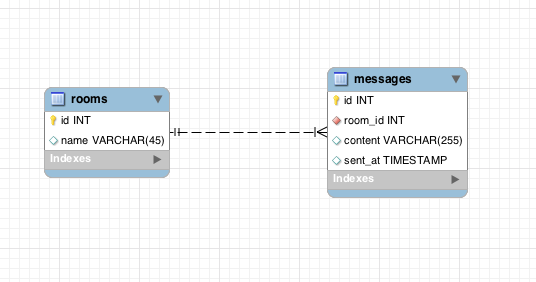
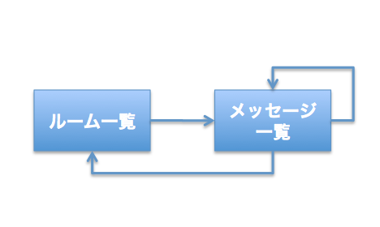
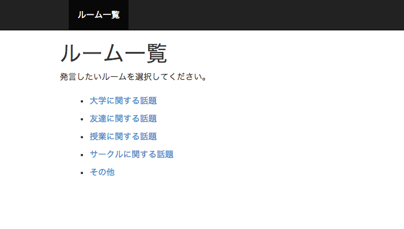
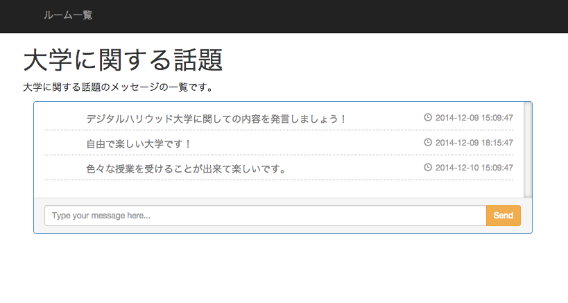
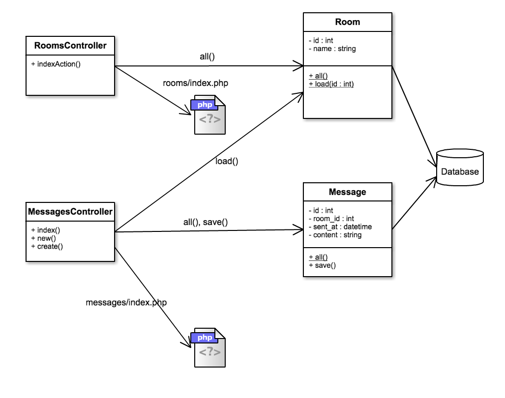

期末試験課題
========

下記の内容をよく読んで課題を行ってください。課題の内容に疑問がある場合には授業中に質問するか、hamada.syougo@mountposition.co.jp 宛にメール、Facebook（https://www.facebook.com/hamada.syougo ）にメッセージのいずれかで連絡してください。

### 試験概要

* Webプログラミング演習Ⅱの期末試験は本課題を **GitHub の試験課題リポジトリに Pull Request を送ることで提出完了とします**。
* 期末試験では、実務で使える技術（GitHub、DataBase、オブジェクト指向、etc..）を使用します。
* 試験課題の提出ができなかった生徒は、筆記による追試も考えています。
* 試験課題中に作成してもらう HTML は自由にデザインして構いません。デザインは採点の対象にはしません。
* 課題の締切りは **2015/01/21 23:00** とします。この時点でリポジトリにコミットされているもので採点を行います。
* 追試が必要な人には別途連絡を行います。追試期間は **別途連絡します** 。
* 仕様のところで記載されている通りの出力が行われるようにプログラミングを行ってください。

---

## 課題の提出方法

試験は試験配布用のリポジトリを Fork して行ってください。試験が終わった人は、配布用リポジトリに Pull Request を行うことで提出完了とします。ただし、どうしても GitHub を利用できない場合には別途提出方法を提示するので相談してください。

* [GitHub はこちら（https://github.com）](https://github.com)

#### 手順1：アカウントを作成する

GitHub にアカウントを作成します。アカウントの作成方法は Lecture2 の資料を参考にしてください。 

#### 手順2：GitHub for Windows、GitHub for Mac をインストールする

GitHub を簡単に利用するためのツールがあるのでインストールを行います。Windows 版は [GitHub for Windows（http://windows.github.com/）](http://windows.github.com/)、Mac 版は [GitHub for Mac（http://mac.github.com）](http://mac.github.com) になります。

#### 手順3：提出用のリポジトリを作成する

試験課題用のリポジトリを Fork して課題実施用のリポジトリを作成します。

#### 手順4：新規ファイルをコミットする

リポジトリに最初のファイルをコミットします。 必ず **学籍番号のファイルを作成し、ファイルの内容に学籍番号と名前を記述してコミットを行ってください。**



#### 手順5：課題の内容をコミットする

期末課題を実施して、出来上がったところからコミットを行ってください。

#### 手順6：全部出来たら Pull Request する

期末課題が全部完了したら、Pull Request を行って、課題を提出してください。



---


# 試験課題

期末課題では、チャットルームとメッセージを管理するシステムを作成してもらいます。データベースでチャットルームとメッセージを管理し、画面では、ルーム一覧ページ、メッセージ入力ページ、メッセージ一覧ページを作成してもらいます。

次の課題を解いて、プログラムを完成させてください。

1. データモデルを確認し、データベースにテーブルを作成すること。データベース作成、テーブル作成、初期データ投入は、初期投入用の SQL 文を利用すること。テーブル作成の SQL 文は各自考えて記述する。
2. 画面仕様を確認して、Webプログラム部分を作成する。プログラムの構造は「アーキテクチャ」の部分にしたがって作成すること。


## 仕様

### データモデル



データベースでは上のデータを管理します。下記にテーブル定義を記載します。

| テーブル名 | 論理テーブル名 |
|------------|----------------|
| rooms   | ルーム           |
| messages      | メッセージ           |

##### ルームテーブル

| カラム名 | 論理カラム名 | 型           | 説明   |
|----------|--------------|--------------|--------|
| id       | ルームID       | INT          | 主キー |
| name     | ルーム名       | VARCHAR(255) |        |


##### メッセージテーブル

| カラム名   | 論理カラム名 | 型       | 説明                                                                 |
|------------|--------------|----------|----------------------------------------------------------------------|
| id         | メッセージID       | INT      | 主キー                                                               |
| room_id | ルームID       | INT      | 外部キー。ルームのIDを格納する。                                   |
| sent_at   | 送信日時     | DATETIME | メッセージの送信日時を格納する。処理時点の現在日時をプログラムから投入する。 |
| content   | メッセージ内容     | VARCHAR(255)      | メッセージ内容。画面から入力される値を投入する。                 |


##### 初期データ投入用の SQL 文

```sql
CREATE DATABASE webpro2examdb DEFAULT CHARACTER SET utf8;
use webpro2examdb;

/* TODO ここにテーブル作成のSQLを記述する。 */

INSERT INTO rooms (id, name) VALUES
    (1, '大学に関する話題'),
    (2, '友達に関する話題'),
    (3, '授業に関する話題'),
    (4, 'サークルに関する話題'),
    (5, 'その他');
```

データベースへのアクセスは、Lecture3 を参考にしてください。

---

### 画面

画面遷移は次のようになります。



##### ルーム一覧画面



##### メッセージ一覧画面



---

### アーキテクチャ

アーキテクチャは MVC とします。ここに現れていないクラスやメソッドを追加することは問題ありません。このアーキテクチャ図は参考程度のものです。

MVCフレームワークは次のサイトを参考にしてください。

* http://jehupc.exblog.jp/19260662/
* http://jehupc.exblog.jp/19260670/





##### クラスの役割

| クラス名 | 説明 |
|----------|------|
| RoomsController | ルーム一覧画面の処理を受け持つクラス。`indexAction` メソッドで `Room#all` を呼び出しルーム一覧を取得したら、`rooms/index.php` で一覧画面を表示する。 |
| MessagesController | メッセージ一覧画面と入力画面の処理を受け持つクラス。`indexAction` メソッドではメッセージ一覧画面を、`newAction` メソッドでは入力画面を表示する。`createAction` メソッドでは送信処理として `Message#save` を呼び出してメッセージデータをデータベースに保存する。 |
| Room | チャットルームモデル。`all` メソッドはデータベースからルームデータを全て取得して返す。`load` メソッドは指定された ID のルームデータのみをロードする。 |
| Message | メッセージモデル。`all` メソッドはデータベースからルームに紐づく全てのメッセージを取得して返す。`save` メソッドは自分自身のデータをデータベースに保存する。 |
| rooms/index.php | ルーム一覧画面のテンプレート |
| messages/index.php | メッセージ一覧画面のテンプレート |

---

## 開発のヒント

### MVC アーキテクチャで View 部分を表示する方法は、PHP の `include` 構文が使えます

##### rooms_controller.php

```php
<?php
class RoomsController {
    public function index() {
        // 何かの処理...

        $model_data = array('部屋1', '部屋2', '部屋3');
        include('views/rooms/index.php');
    }
}

$controller = new RoomsController();
$controller->index();
```

##### rooms/index.php

```html
<!DOCTYPE html>
<html lang="ja">
<body>
    <ul>
    <?php
        foreach ($model_data as $name) {
            echo "<li>${name}</li>";
        }
    ?>
    </ul>
</body>
</html>
```

- 部屋1
- 部屋2
- 部屋3


### モデルクラスの属性をコントローラやビューの中で参照や設定をしたい場合は、モデルクラスに getter/setter を用意します

アーキテクチャのクラス図を見るとわかるように、`Room` や `Message` のクラスには `private` な属性(id, name など)があります。private な属性は自分自身のクラスの中からしか参照することができません。別のクラスからも参照したい場合には、`getId` や `setName` などのメソッドを用意します。

```php
<?php

class Sale {

    private $id;
    private $room_id;
    private $sent_at;
    private $message;

    public function __construct($params) {
        $this->id         = isset($params['id']) ? $params['id'] : null;
        $this-> room_id = isset($params['room_id']) ? $params['room_id'] : null;
        $this->sent_at   = isset($params['sent_at']) ? $params['sent_at'] : null;
        $this->content   = isset($params['content']) ? $params['content'] : null;
    }


    public static function all() {
    }

    public function save() {
    }

    public function getId() {
        return $this->id;
    }

    public function setId($id) {
        $this->id = $id;
    }

    public function getRoomId() {
        return $this->room_id;
    }

    public function setRoomId($room_id) {
        $this->room_id = $room_id;
    }
    // 略
}
```


### データベースの ID カラムに自動で連番を振る方法

メッセージデータを登録する際に、ID カラムに自動で連番を振りたいと思います。そんなときはテーブル作成時に ID カラムに AUTO_INCREMENT を指定しましょう。

```sql
CREATE TABLE messages(
    id integer primary key AUTO_INCREMENT,
    /* 略 */
);
```


### PDO を使ったデータベース処理でよくわからないエラーが起こったら

PDO には直前に発生したエラーを取得するための `errorInfo` というメソッドが用意されています。エラーが起こっているかどうか確認したい場合にはこのメソッドを使いましょう。

```php
<?php
$pdo = new PDO('略', '略', '略');
$stmt = $pdo->prepare('略');

if ($stmt) {
    $stmt->bindParam(/* 略 */);
    if ($stmt->execute()) {
        /* 略 */
    } else {
        var_dump($stmt->errorInfo());
    }
} else {
    var_dump($pdo->errorInfo());
}
```
